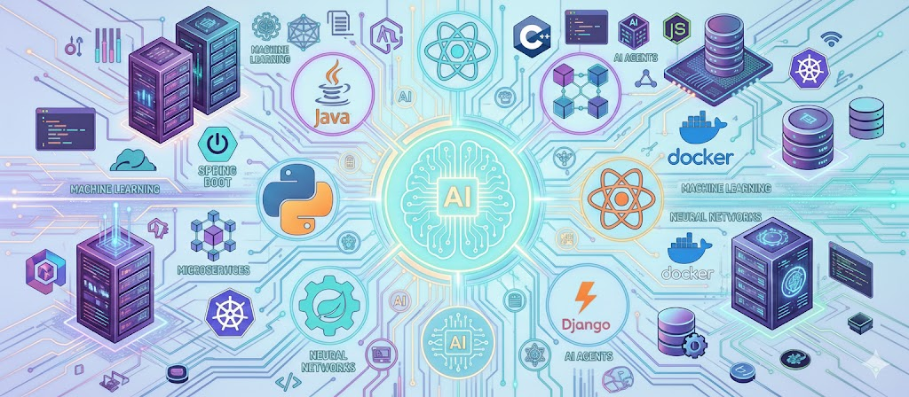

# 

  

# Gabriel Murillo Medina
### 🧠 Cybersecurity | SOC | ML | Cloud | DevSecOps

🔐 Apasionado por **ciberseguridad** y SOC. 🤖 Desarrollo de agentes IA. Interesado en detection, SIEM, y ML aplicado a seguridad.

  

 

 

---

## 🚀 Sobre mí

- 🔐 Apasionado por **ciberseguridad y SOC**
- 🤖 Desarrollo de **agentes IA**

---

## 🧰 Tecnologías

| Área | Herramientas |
|----|----|
| SOC | Wazuh, Zeek, Suricata |
| Pentesting | Metasploit, Nmap |
| Backend | FastAPI, Flask, Django |
| IA | ONNX, TensorFlow |
| DevOps | Docker, GitHub Actions |

---

## 🧠 Proyectos Destacados

  

    
    <h3 style="margin:10px 0 6px;">SymptoLeaf</h3>
    
Detector ML para enfermedades en plantas: entrenamiento con imágenes, inferencia ONNX y despliegue ligero para edge.

    
<strong>Tecnologías:</strong> Python • ONNX • FastAPI

  

  

    
    <h3 style="margin:10px 0 6px;">SOC Lab</h3>
    
Laboratorio de seguridad: pipelines SIEM, integración Wazuh, IDS (Suricata) y playbooks para Threat Hunting.

    
<strong>Tecnologías:</strong> Wazuh • Suricata • Zeek

  

 

---

## 📊 Stats

  

---

## 📫 Contacto

- 💼 LinkedIn: [https://linkedin.com/](https://www.linkedin.com/in/gmurillo-medina/)

