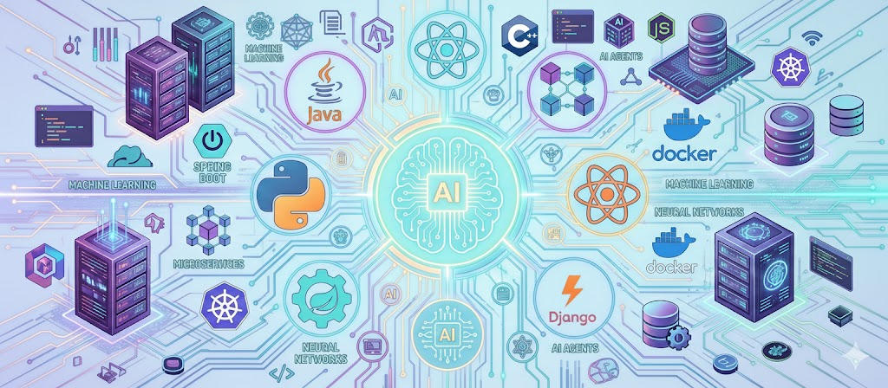

# 
  

  

<h1 align="center">Gabriel Murillo </h1>

  <b>Ingeniero de Software</b> 
  <i>BACKEND & FRONTEND DEVELOPER</i>

  
  

---

### 🚀 Sobre Mí
Estudiante de 7mo Semestre de Ingeniería en Software en la Universidad de las Fuerzas Armadas. Apasinado de los agentes IA con Python, los sistemas distribuidos, y el desarrollado de aplicaciones seguras basadas en shift-left.

---

### 🛠️ Tech Stack & Stats

  
  
  
  
  

---

### 🌟 Proyectos Destacados (Mis 7 Proyectos Key)

<table align="center">
  <tr>
    <td width="50%" valign="top">
      <h4 align="center">📈 Asset Manager & AI</h4>
      
Gestión de carteras financieras con motores C++ e IA para análisis predictivo cuantitativo.

      
<code>C++ • Python • Finance</code>

    </td>
    <td width="50%" valign="top">
      <h4 align="center">🧠 SciMind</h4>
      
Agente inteligente para investigación científica y gestión de conocimiento con LLMs.

      
<code>LangChain • OpenAI • FastAPI</code>

    </td>
  </tr>
  <tr>
    <td width="50%" valign="top">
      <h4 align="center">🛡️ pySentinel SOC5</h4>
      
Detección de amenazas con Wazuh, Suricata y Velociraptor para monitoreo en tiempo real.

      
<code>SOC • Wazuh • Docker</code>

    </td>
    <td width="50%" valign="top">
      <h4 align="center">🎵 Cyber Music Player</h4>
      
Interfaz de audio móvil con estética cyberpunk en Flutter y experiencia inmersiva.

      
<code>Flutter • UI/UX • Mobile</code>

    </td>
  </tr>
  <tr>
    <td width="50%" valign="top">
      <h4 align="center">🎙️ SpeechNotes</h4>
      
Transcriptor y resumidor inteligente de notas de voz con modelos SOTA.

      
<code>WHISPER • AI • Python</code>

    </td>
    <td width="50%" valign="top">
      <h4 align="center">🍃 SymptoLeaf</h4>
      
Detector de enfermedades agrícolas mediante visión artificial y optimización ONNX.

      
<code>PyTorch • CV • Edge Computing</code>

    </td>
  </tr>
  <tr>
    <td colspan="2" width="100%" valign="top">
      <h4 align="center">📋 Planning App</h4>
      
Gestión de tareas con enfoque en UX/UI para optimizar flujos de trabajo profesionales.

      
<code>JS • UX/UI • Productivity</code>

    </td>
  </tr>
</table>

  

---

### 📈 Actividad Reciente

  

  Let's connect: <a href="https://www.linkedin.com/in/gmurillo-medina/">LinkedIn</a> | <a href="https://gamurigm.github.io/#projects">Portfolio & Projects</a>

